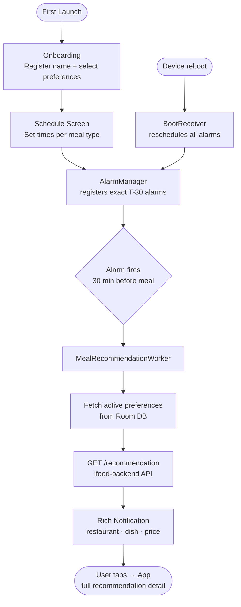

# iFood Android — Meal Scheduling App

A native Android application built for the **iFood Selection Process**. The app lets users schedule daily meal times, define dietary preferences, and receive AI-powered restaurant recommendations 30 minutes before each meal via push notifications.

---

## Tech Stack

| Layer | Technology |
|-------|-----------|
| Language | Kotlin 2.3 |
| UI | Jetpack Compose + Material 3 |
| Architecture | MVVM + Clean Architecture |
| DI | Hilt 2.59.2 |
| Local DB | Room 2.8.4 |
| Preferences | DataStore |
| Networking | Retrofit 3 + OkHttp 5 + Moshi |
| Background | WorkManager + AlarmManager |
| Navigation | Navigation Compose 2.9.8 |
| Testing | JUnit 4 · MockK · Kover · Espresso · Compose Test |
| CI | GitHub Actions |

---

## Quick Start

```bash
git clone https://github.com/<your-org>/ifood-android.git
cd ifood-android

# Build & install debug
./gradlew installDebug

# Run unit tests
./gradlew testDebugUnitTest

# Generate coverage report
./gradlew koverHtmlReportDebug
# → app/build/reports/kover/htmlDebug/index.html
```

> **Backend:** The recommendation API lives in the `ifood-backend/` folder (Node.js/TypeScript). Start it separately and configure `BASE_URL` in `local.properties` before running the app.

---

## How It Works



1. **Onboarding:** on first launch the user registers their name and selects dietary preferences.
2. **Schedule:** the user sets a time for each meal slot (Breakfast, Lunch, Afternoon Snack, Dinner).
3. **Alarms:** `MealRecommendationScheduler` registers an exact `AlarmManager` alarm 30 minutes before each scheduled meal.
4. **Boot resilience:** `BootReceiver` listens for `BOOT_COMPLETED` and reschedules all alarms after a device restart.
5. **Worker:** when an alarm fires, `MealRecommendationWorker` reads the user's active preferences from Room and calls `GET /recommendation` on the backend, passing the meal type and preference labels.
6. **Notification:** a rich notification is posted showing the restaurant name, dish, and price.
7. **Detail view:** tapping the notification opens `MainActivity` with the full recommendation (dish description, address, image).

---

## Documentation

| Document | Contents |
|----------|---------|
| [Overview](docs/overview.md) | App purpose, user journey, and full feature list |
| [Architecture](docs/architecture.md) | Clean Architecture layers, MVVM, DI modules, notification pipeline, Room schema |
| [Dependencies](docs/dependencies.md) | All libraries with versions and rationale |
| [Testing](docs/testing.md) | Test strategy, coverage breakdown, and tooling |
| [CI](docs/ci.md) | GitHub Actions pipelines: PR checks and signed release publishing |

---

## Project Structure

```
app/src/main/java/com/lc/ifood/
├── data/          # Room DAOs, entities, Retrofit service, repository implementations
├── di/            # Hilt modules (App, Network, Dao, Repository)
├── domain/        # Models, repository interfaces, use cases
├── ui/            # Composable screens, ViewModels, UiState classes
├── worker/        # AlarmReceiver, BootReceiver, MealRecommendationWorker, Scheduler
├── MainActivity.kt
└── MainApplication.kt
```

---

## License

This project was created as part of a technical selection process. All rights reserved.
