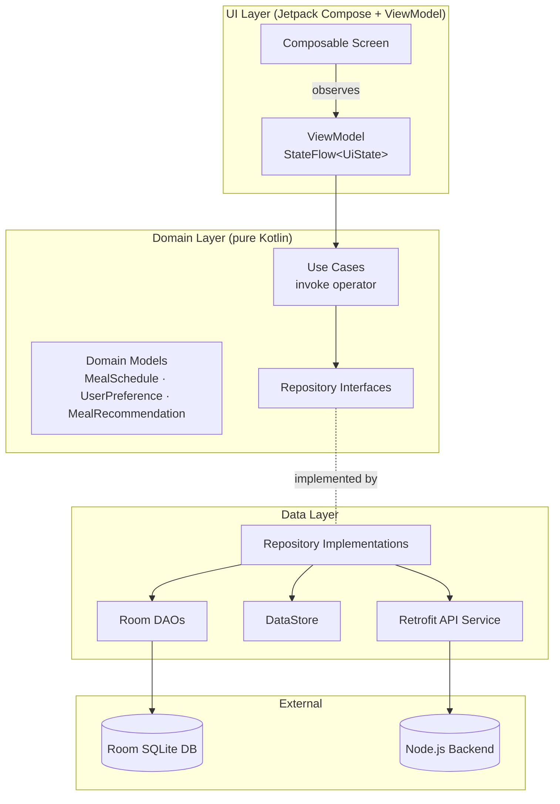
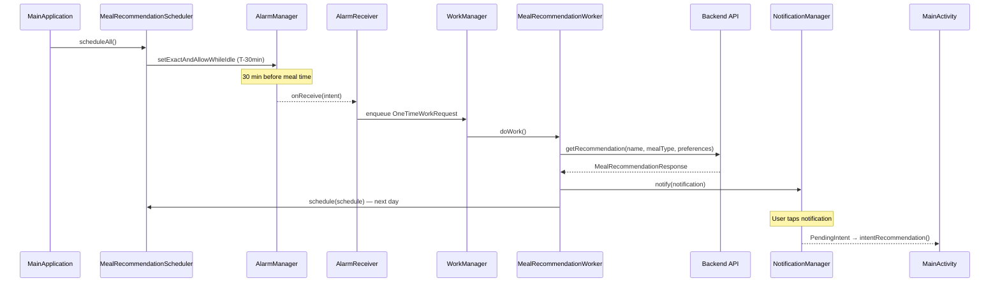
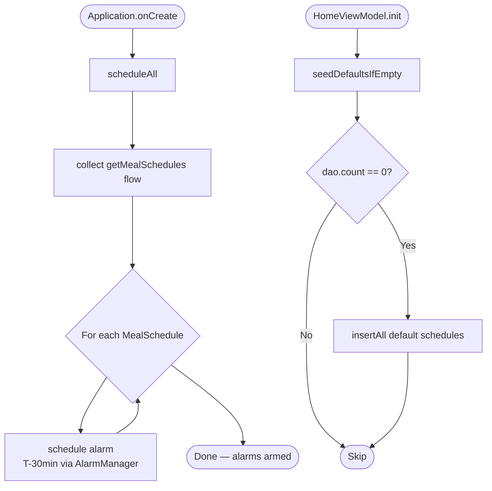
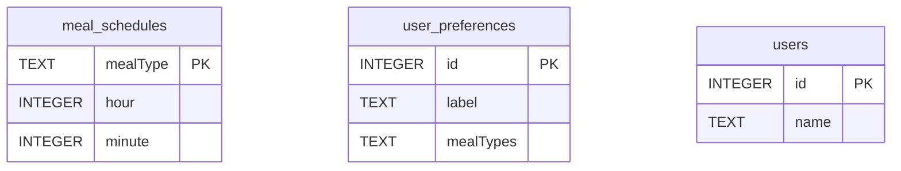

# Architecture

The app follows **Clean Architecture** with three explicit layers — UI, Domain, and Data — plus a cross-cutting Worker layer for background processing.

---

## Layer Diagram



---

## Notification Pipeline



---

## App Startup Flow



---

## Room Database Schema



> `mealTypes` in `user_preferences` is a comma-separated list of `MealType` names (e.g. `"BREAKFAST,LUNCH"`). See [`UserPreferenceDao`](../app/src/main/java/com/lc/ifood/data/db/dao/UserPreferenceDao.kt) for the CSV-aware query.

---

## MVVM Pattern

Each screen has a dedicated **ViewModel** that:
- Exposes a single `StateFlow<UiState>` — immutable, collected by the Composable.
- Launches coroutines in `viewModelScope` for all async work.
- Delegates business logic entirely to **Use Cases**.

```
Screen ──collect──▶ StateFlow<UiState>  ◀──emit── ViewModel
                                                       │
                                               Use Case invoke()
                                                       │
                                              Repository interface
```

---

## Dependency Injection (Hilt)

| Module | Installs in | Provides |
|--------|------------|----------|
| `AppModule` | `SingletonComponent` | `DataStore`, `WorkManager`, `AppDatabase` |
| `NetworkModule` | `SingletonComponent` | `Moshi`, `OkHttpClient`, `Retrofit`, `MealReminderApiService` |
| `DaoModule` | `SingletonComponent` | `MealScheduleDao`, `UserPreferenceDao`, `UserDao` |
| `RepositoryModule` | `SingletonComponent` | All repository bindings (interface → impl) |

ViewModels are injected via `@HiltViewModel`. The `MealRecommendationWorker` uses `@HiltWorker` + `@AssistedInject` and requires the custom `HiltWorkerFactory` configured in `MainApplication`.

---

## Navigation

Navigation is handled by **Jetpack Navigation Compose** (`navigation-compose 2.9.x`). Routes are defined as sealed objects/data objects in `AppRoutes`. The `SplashViewModel` determines the initial destination (`Loading → Home | Onboarding`) by reading the DataStore-backed onboarding flag.
