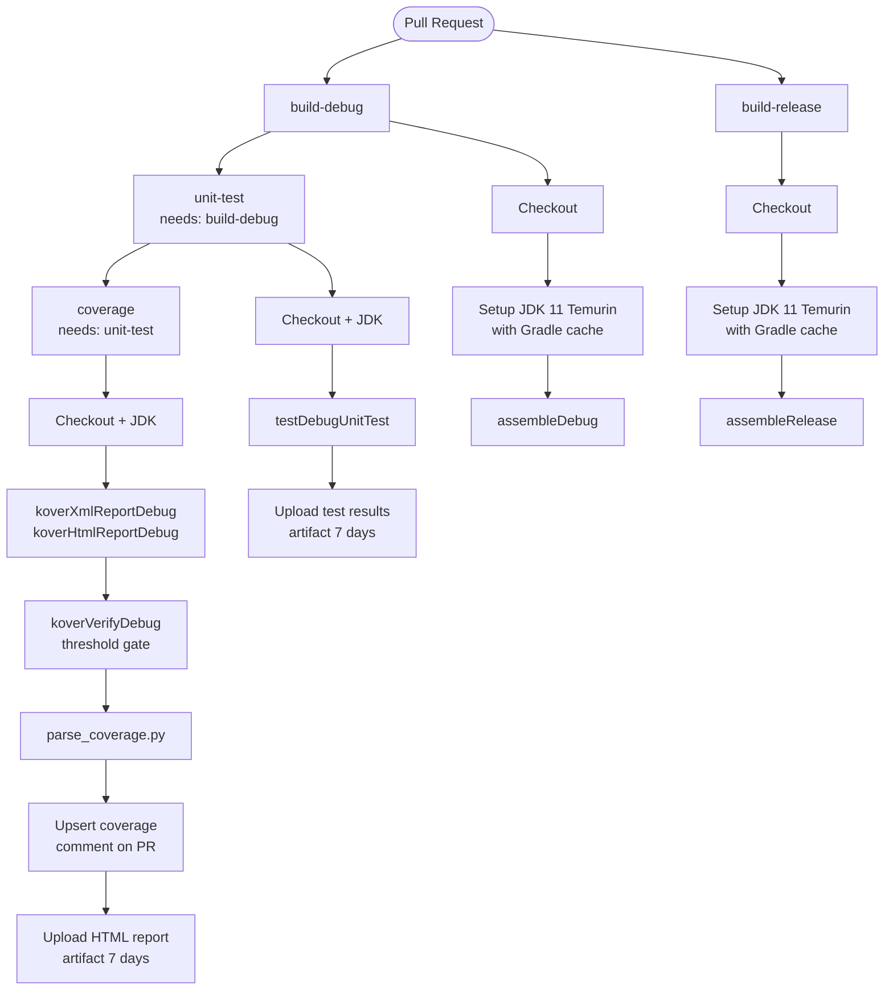
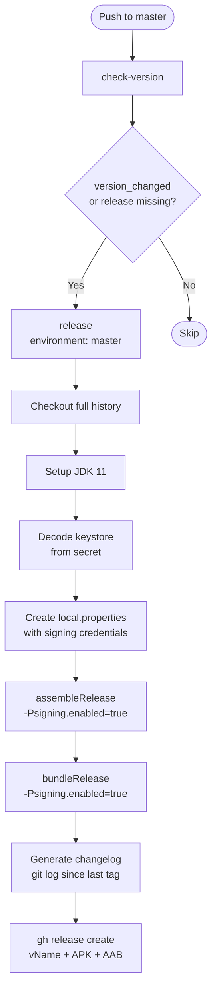

# Continuous Integration & Release

The project uses **GitHub Actions** with two workflows:

- **PR Checks** (`.github/workflows/pr-checks.yml`) — validates every pull request targeting `master`
- **Release** (`.github/workflows/release.yml`) — publishes a signed release on every push to `master` that bumps the version

---

## PR Checks

### Trigger

```yaml
on:
  pull_request:
    branches: [ "master" ]
```

### Job Pipeline

Four jobs run on every PR. `build-debug` and `build-release` start in parallel; `unit-test` waits for `build-debug`; `coverage` waits for `unit-test`.



### Steps Breakdown

#### `build-debug`

| Step | Command / Action | Notes |
|------|-----------------|-------|
| Checkout | `actions/checkout@v4` | Full repo clone |
| JDK Setup | `actions/setup-java@v4` (Temurin 11) | Gradle dependency cache enabled |
| Grant permission | `chmod +x gradlew` | Required on Linux runners |
| Build | `./gradlew assembleDebug` | Compiles and packages the debug APK |

#### `build-release` (parallel with `build-debug`)

| Step | Command / Action | Notes |
|------|-----------------|-------|
| Checkout | `actions/checkout@v4` | |
| JDK Setup | `actions/setup-java@v4` (Temurin 11) | |
| Grant permission | `chmod +x gradlew` | |
| Build | `./gradlew assembleRelease` | Compiles and packages the release APK |

#### `unit-test` (needs `build-debug`)

| Step | Command | Notes |
|------|---------|-------|
| Unit tests | `./gradlew testDebugUnitTest` | Runs all JVM unit tests |
| Upload test results | `actions/upload-artifact@v4` | JUnit XML results; retained 7 days |

#### `coverage` (needs `unit-test`)

| Step | Command | Notes |
|------|---------|-------|
| Coverage report | `./gradlew koverXmlReportDebug koverHtmlReportDebug` | Generates XML (for parsing) and HTML (for artifact) |
| Coverage threshold | `./gradlew koverVerifyDebug` | Fails the job if coverage drops below the configured minimum |
| Parse coverage | `python3 .github/scripts/parse_coverage.py` | Extracts metrics from Kover XML; always runs so a missing report yields a graceful fallback message |
| Upsert PR comment | `gh pr comment` / `gh api PATCH` | Posts or updates a Markdown coverage table on the PR |
| Upload HTML report | `actions/upload-artifact@v4` | Retained 7 days; downloadable from the Actions run page |

### PR Coverage Comment

After each run the coverage job upserts a single bot comment (updates it if it already exists, otherwise creates it):

```
## 📊 Coverage Report — Debug

| Metric       | Covered | Total | %     |
|--------------|---------|-------|-------|
| Lines        | 312     | 389   | 80%   |
| Branches     | 84      | 110   | 76%   |
| Instructions | 1 240   | 1 530 | 81%   |
```

If the coverage report is unavailable (e.g. the build failed before Kover ran), the comment falls back to:

> *Coverage data unavailable (build or verification may have failed).*

### Artifacts

| Artifact name | Contents | Retention |
|--------------|----------|-----------|
| `coverage-report-debug` | Kover HTML report | 7 days |
| `test-results-debug` | JUnit XML test results | 7 days |

---

## Release

### Trigger

```yaml
on:
  push:
    branches: [ "master" ]
```

Runs on every push to `master`. A release is only published when the version actually changed.

### Job Pipeline



### `check-version`

Compares `app.versionName` and `app.versionCode` in `gradle.properties` between `HEAD` and `HEAD^`. Also checks whether the GitHub release tag `v{versionName}` already exists.

Outputs: `version_changed`, `version_name`, `version_code`, `release_exists`.

### `release` (needs `check-version`; skipped if version unchanged and release exists)

Runs in the `master` environment (requires approval if configured).

| Step | Notes |
|------|-------|
| Decode `ANDROID_KEYSTORE` | Base64-decode secret → `app/ifood.jks` |
| Create `local.properties` | Writes signing credentials from secrets |
| `assembleRelease -Psigning.enabled=true` | Signed APK |
| `bundleRelease -Psigning.enabled=true` | Signed AAB |
| Generate changelog | `git log <last-tag>..HEAD --pretty=format:"- %s"` (up to 30 commits) |
| `gh release create` | Tag `v{versionName}`, attaches APK + AAB as release assets |

### Required Secrets

| Secret | Purpose |
|--------|---------|
| `ANDROID_KEYSTORE` | Base64-encoded `.jks` keystore file |
| `ANDROID_KEYSTORE_PASSWORD` | Keystore password |
| `ANDROID_KEY_ALIAS` | Key alias |
| `ANDROID_KEY_PASSWORD` | Key password |

---

## Running Checks Locally

```bash
# Build
./gradlew assembleDebug

# Unit tests
./gradlew testDebugUnitTest

# Coverage
./gradlew koverHtmlReportDebug
# Open: app/build/reports/kover/htmlDebug/index.html

# Coverage threshold gate
./gradlew koverVerifyDebug
```
