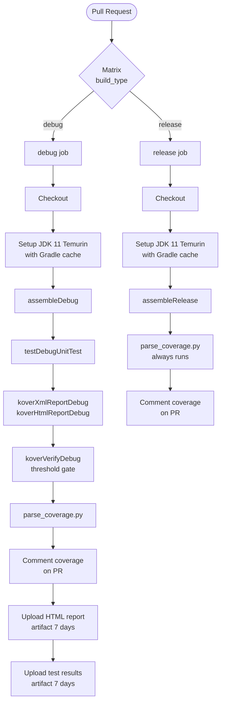

# Continuous Integration

The project uses **GitHub Actions** to validate every pull request targeting `master`. The workflow is defined in [`.github/workflows/pr-checks.yml`](../.github/workflows/pr-checks.yml).

---

## Trigger

```yaml
on:
  pull_request:
    branches: [ "master" ]
```

Every PR opened or updated against `master` runs the full check suite before merge.

---

## Build Matrix

The workflow uses a **matrix strategy** to run `debug` and `release` variant checks in parallel. This ensures both APK variants are buildable on every PR — a broken release build would not block a debug-only check otherwise.



---

## Steps Breakdown

### Shared (both variants)

| Step | Command / Action | Notes |
|------|-----------------|-------|
| Checkout | `actions/checkout@v4` | Full repo clone |
| JDK Setup | `actions/setup-java@v4` (Temurin 11) | Gradle dependency cache enabled |
| Grant permission | `chmod +x gradlew` | Required on Linux runners |
| Build | `./gradlew assemble{Debug\|Release}` | Compiles and packages the APK |
| Parse coverage | `python3 .github/scripts/parse_coverage.py` | Extracts metrics from Kover XML; always runs so a missing report yields a graceful fallback message |
| Comment on PR | `gh pr comment` | Posts a Markdown table with line/branch/instruction coverage percentages |

### Debug only

| Step | Command | Notes |
|------|---------|-------|
| Unit tests | `./gradlew testDebugUnitTest` | Runs all JVM unit tests |
| Coverage report | `./gradlew koverXmlReportDebug koverHtmlReportDebug` | Generates XML (for parsing) and HTML (for artifact) |
| Coverage threshold | `./gradlew koverVerifyDebug` | Fails the job if coverage drops below the configured minimum |
| Upload HTML report | `actions/upload-artifact@v4` | Retained 7 days; downloadable from the Actions run page |
| Upload test results | `actions/upload-artifact@v4` | JUnit XML results; retained 7 days |

---

## PR Coverage Comment

After each run, a comment is posted to the PR with a table like:

```
## Coverage Report — Debug

| Metric       | Covered | Total | %     |
|--------------|---------|-------|-------|
| Lines        | 312     | 389   | 80%   |
| Branches     | 84      | 110   | 76%   |
| Instructions | 1 240   | 1 530 | 81%   |
```

If the coverage report is unavailable (e.g. the build failed before Kover ran), the comment falls back to:

> *Coverage data unavailable (build or verification may have failed).*

---

## Artifacts

| Artifact name | Contents | Retention |
|--------------|----------|-----------|
| `coverage-report-debug` | Kover HTML report | 7 days |
| `test-results-debug` | JUnit XML test results | 7 days |

Artifacts are downloadable from the **Actions** tab of the repository for post-mortem investigation.

---

## Running Checks Locally

```bash
# Build
./gradlew assembleDebug

# Unit tests
./gradlew testDebugUnitTest

# Coverage
./gradlew koverHtmlReportDebug
# Open: app/build/reports/kover/htmlDebug/index.html

# Coverage threshold gate
./gradlew koverVerifyDebug
```
