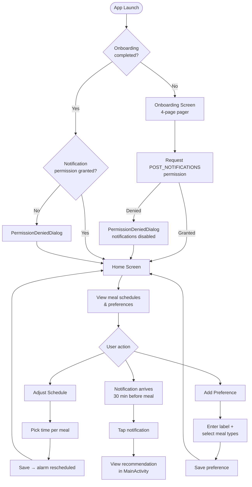

# Project Overview

iFood Android is a meal scheduling application that combines local time management with AI-powered restaurant recommendations. Users set daily meal times, define dietary preferences, and receive proactive notifications — 30 minutes before each meal — suggesting a nearby restaurant and dish that matches their profile.

---

## User Journey

---

## Features

| Feature | Description |
|---------|-------------|
| **Onboarding** | 4-page introduction pager. Completes once; skipped on subsequent launches. Requests `POST_NOTIFICATIONS` permission during the flow. |
| **Meal Schedule Management** | Four fixed meal slots (Breakfast, Lunch, Afternoon Snack, Dinner) with user-adjustable times. Defaults seeded on first launch (08:00 / 13:00 / 17:00 / 21:00). |
| **Dietary Preferences** | Users create named preference tags and associate them with one or more meal types. Preferences filter the AI recommendation for each meal. |
| **AI Meal Recommendations** | Backend API receives the user's name, meal type, and preference labels and returns a restaurant + dish suggestion with price and address. |
| **Proactive Notifications** | AlarmManager fires 30 minutes before each scheduled meal. The notification shows the restaurant name, dish, and price. Tapping opens the full recommendation in the app. |
| **Daily Alarm Cycle** | After each notification is posted, the alarm for that meal is rescheduled for the next day automatically. |
| **Boot Resilience** | `BootReceiver` listens for `BOOT_COMPLETED` and reschedules all meal alarms after a device restart, ensuring the notification chain is never broken. |
| **Local Persistence** | Room database stores schedules, preferences, and the user profile. DataStore persists the onboarding completion flag. |
| **Default Schedule Seeding** | On first install, sensible default meal times are written to the database so the alarm chain starts immediately after onboarding. |

---

## Supported Meal Types

| Enum Value | Default Time |
|------------|-------------|
| `BREAKFAST` | 08:00 |
| `LUNCH` | 13:00 |
| `AFTERNOON_SNACK` | 17:00 |
| `DINNER` | 21:00 |
