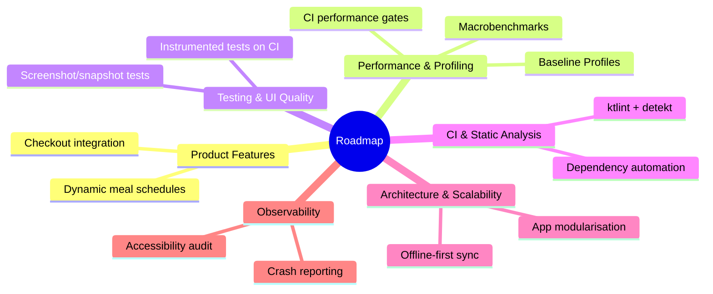

# Roadmap — Future Improvements & Technical Debt

This document maps planned improvements, technical debt, and architectural evolutions for the iFood Android project. Items are grouped by domain to facilitate prioritisation and sprint planning.

---

---

## 1. Product Features

| Item | Description | Priority |
|---|---|---|
| Dynamic meal schedules | Allow users to add multiple time slots per meal type, providing greater flexibility in their daily agenda | High |
| Checkout integration | Connect `MealRecommendation` results directly to the checkout flow so users can purchase a suggestion natively without leaving the app | High |

---

## 2. Performance & Profiling

| Item | Description | Priority |
|---|---|---|
| Macrobenchmark integration | Add automated tests using Jetpack `Macrobenchmark` to validate TTID, TTFD, jank, and frame drops consistently across builds | Medium |
| Baseline Profiles | Generate and ship a `BaselineProfile` to enable AOT compilation of hot paths, reducing cold startup time and improving scroll fluency | Medium |
| CI performance gates | Add a CI step that fails a PR automatically when startup-time regressions exceed a defined threshold | Low |

---

## 3. Automated Testing & UI Quality

| Item | Description | Priority |
|---|---|---|
| Instrumented tests on CI | Configure CI to run existing `androidTest` suites against cloud emulators to validate E2E flows and Room database migrations | High |
| Screenshot / snapshot testing | Implement visual regression tests with [Paparazzi](https://github.com/cashapp/paparazzi) or [Roborazzi](https://github.com/takahirom/roborazzi) to catch unintended layout and theme changes in Compose on the JVM | Medium |

---

## 4. CI & Static Analysis

| Item | Description | Priority |
|---|---|---|
| ktlint + detekt | Enable `ktlint` (formatting) and `detekt` (code smells, complexity) as blocking checks in the CI pipeline | Medium |
| Dependency automation | Add Renovate or Dependabot to automate version bump PRs against `gradle/libs.versions.toml` | Low |

---

## 5. Architecture & Scalability

| Item | Description | Priority |
|---|---|---|
| App modularisation | Split the monolithic `app` module into `:core:*` and `:feature:*` modules (e.g., `:core:data`, `:feature:recommendation`) to accelerate build times and enforce encapsulation | Low |
| Offline-first sync | Evolve data writes to use a resilient WorkManager queue so changes made without connectivity are synchronised transparently once the connection is restored | Medium |

---

## 6. Observability & Production Readiness

| Item | Description | Priority |
|---|---|---|
| Crash reporting & analytics | Integrate Firebase Crashlytics or Sentry to monitor stability and understand the user conversion funnel | Medium |
| Accessibility (A11y) audit | Ensure full TalkBack navigation support and add automated checks for touch target sizes and colour contrast ratios | Low |

---

## Summary

| Area | Item | Priority |
|---|---|---|
| Product Features | Dynamic meal schedules | High |
| Product Features | Checkout integration | High |
| Testing & UI Quality | Instrumented tests on CI | High |
| Performance & Profiling | Macrobenchmark integration | Medium |
| Performance & Profiling | Baseline Profiles | Medium |
| Testing & UI Quality | Screenshot / snapshot testing | Medium |
| CI & Static Analysis | ktlint + detekt | Medium |
| Architecture & Scalability | Offline-first sync | Medium |
| Observability | Crash reporting & analytics | Medium |
| Performance & Profiling | CI performance gates | Low |
| CI & Static Analysis | Dependency automation | Low |
| Architecture & Scalability | App modularisation | Low |
| Observability | Accessibility (A11y) audit | Low |
