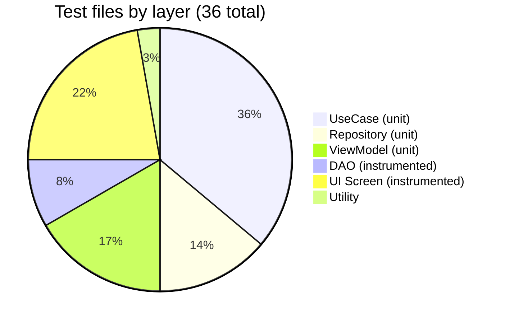
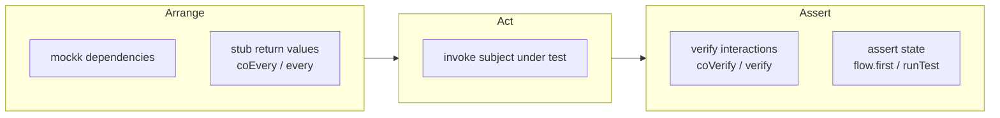

# Testing

The project has two test suites: **unit tests** (JVM-only, no Android runtime) and **instrumented tests** (run on a device or emulator).

---

## Test Distribution



---

## Unit Test Strategy



Unit tests live under `app/src/test/` and run purely on the JVM with no Android framework dependency.

### Repository Layer

Tests focus on **mapping logic** (entity → domain model) and **guard conditions**:

| Test Class | Key scenarios |
|-----------|---------------|
| `MealScheduleRepositoryImplTest` | Maps entities to domain; returns defaults on empty DAO; `seedDefaultsIfEmpty` idempotency |
| `UserRepositoryImplTest` | Entity mapping; null emission; **in-memory cache** — verifies the DAO is not called a second time |
| `PreferenceRepositoryImplTest` | CSV → `List<MealType>` parsing; multi-type filtering; insert CSV encoding |
| `MealRecommendationRepositoryImplTest` | API call parameters; response → domain mapping; `mealType` lowercase contract; null user throws |
| `OnboardingRepositoryImplTest` | DataStore key read/write; false-when-absent default |

### Use Case Layer

Use cases are thin delegators. Tests verify **delegation correctness** and any **parameter transformation**:

| Test Class | Key scenarios |
|-----------|---------------|
| `UpdateMealScheduleUseCaseTest` | Repository called before scheduler (order verified via `coAnswers`) |
| `GetMealRecommendationUseCaseTest` | `UserPreference.label` extracted before reaching repository |
| `GetMealsUseCaseTest` | Flow of schedules mapped to `List<MealType>` |
| All others | Single delegation call with correct parameters |

### ViewModel Layer

Tests verify **StateFlow emissions** and use-case delegation:

| Test Class | Key scenarios |
|-----------|---------------|
| `HomeViewModelTest` | `combine` of three flows emits correct `HomeUiState`; `seedDefaultSchedules` called on init |
| `AddPreferenceViewModelTest` | `canSave` gate prevents save when label blank or no meal selected; trimmed label sent to use case |
| `DeletePreferenceViewModelTest` | `delete` delegates to use case with the correct preference ID |
| `ScheduleAdjustmentViewModelTest` | `updateTime` modifies only the targeted schedule; `saveAll` iterates all items |
| `SplashViewModelTest` | `Loading → Home` and `Loading → Onboarding` transitions from flow |
| `OnboardingViewModelTest` | FAB visibility delay; last-page completion flag |

---

## Test Utilities

### `MainDispatcherRule`

A JUnit `TestWatcher` that replaces `Dispatchers.Main` with an `UnconfinedTestDispatcher` (or a custom one) for the duration of each test. Required for any ViewModel test that touches `viewModelScope`.

```kotlin
@get:Rule
val mainDispatcherRule = MainDispatcherRule()
```

### Time Control

Tests that rely on delays (e.g. FAB visibility animation in `OnboardingViewModel`) use `StandardTestDispatcher` with explicit time advancement:

```kotlin
testDispatcher.advanceTimeBy(600)   // skip the 500ms debounce
testDispatcher.advanceUntilIdle()   // drain all pending coroutines
```

---

## Instrumented Tests

Instrumented tests live under `app/src/androidTest/` and run on a real device or emulator.

### DAO Integration Tests

Use an **in-memory Room database** to test the actual SQL queries without touching the file system:

```kotlin
db = Room.inMemoryDatabaseBuilder(context, AppDatabase::class.java)
    .allowMainThreadQueries()
    .build()
```

| Test Class | Key scenarios |
|-----------|---------------|
| `MealScheduleDaoTest` | `upsert` replaces existing rows; Flow and one-shot reads return consistent data |
| `UserPreferenceDaoTest` | CSV `getByMealType` — all four LIKE patterns; partial-name exclusion |
| `UserDaoTest` | Null emission on empty table; auto-increment ID; single-row constraint |

### Compose UI Tests

Compose screens are tested in isolation using `createAndroidComposeRule<ComponentActivity>`. Each test renders the Composable with a hand-crafted state and asserts the semantic tree:

```kotlin
rule.setContent {
    HomeScreen(uiState = HomeUiState(mealSchedules = schedules), ...)
}
rule.onNodeWithText("Breakfast").assertIsDisplayed()
```

| Test Class | Key scenarios |
|-----------|---------------|
| `HomeScreenTest` | Schedule labels visible; edit/add button callbacks fire |
| `HomeHeaderTest` | Welcome text visible; user name displayed; name dialog shown when user loaded with null name; dialog confirms with trimmed name; blank name does not trigger callback |
| `MealSchedulesSectionTest` | Section title visible; meal labels and formatted times displayed; edit button fires callback |
| `PreferencesSectionTest` | Section title and preference labels visible; add button fires callback; empty state message shown when no preferences |
| `MealRecommendationBottomSheetTest` | Meal name, description, place name, address, price displayed; meal type badge shown; preference tags visible or hidden based on list; buy button fires dismiss callback |
| `ScheduleAdjustmentScreenTest` | Save button enabled/disabled based on `isSaving`; time picker opens on edit icon |
| `OnboardingScreenTest` | Page content; FAB text changes on last page; FAB hidden when `isFabVisible = false` |
| `AddPreferenceScreenTest` | Save button disabled when `canSave = false`; label field propagates changes |

---

## Coverage

Code coverage is measured by [Kover](https://github.com/Kotlin/kotlinx-kover) and reported in CI on every PR.

```
./gradlew koverHtmlReportDebug   # HTML report → app/build/reports/kover/htmlDebug/
./gradlew koverVerifyDebug       # Fails if coverage drops below the configured threshold
```

See [`docs/ci.md`](ci.md) for how coverage results are posted as PR comments automatically.
